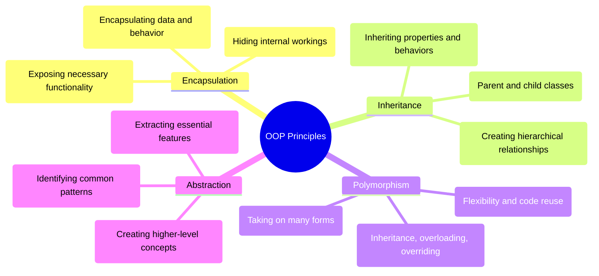
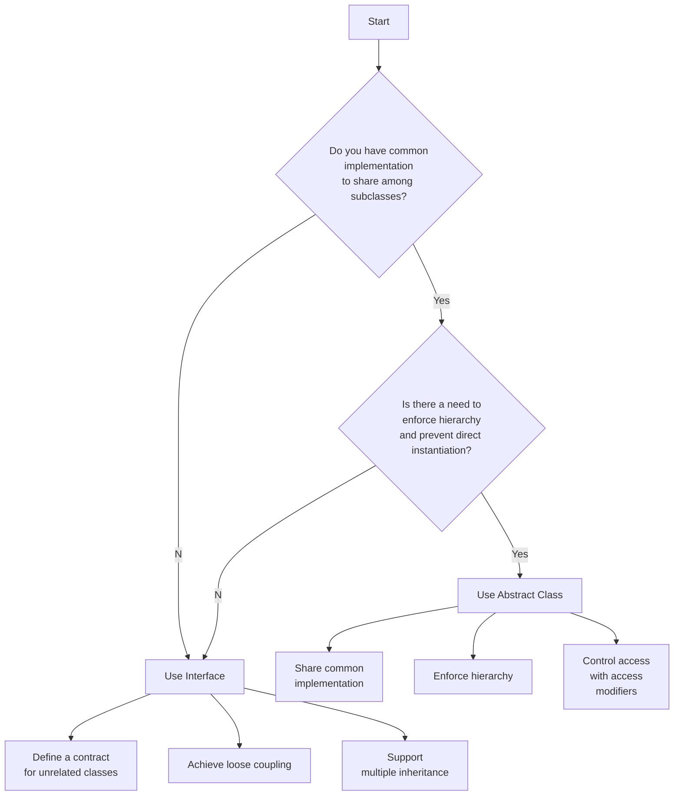

## What are the four principles of OOP?

## What is the difference between an abstract class and an interface?

| Feature         | Abstract Class                               | Interface                                                                            |
| --------------- | -------------------------------------------- | ------------------------------------------------------------------------------------ |
| Purpose         | Partial abstraction, shared implementation   | Complete abstraction, contract                                                       |
| Methods         | Can have abstract and non-abstract methods   | Traditionally only abstract methods (can have default and static methods in Java 8+) |
| Inheritance     | Supports single inheritance                  | Supports multiple inheritance                                                        |
| Variables       | Can have static, nonstatic, final, non-final | Only static final variables                                                          |
| Implementatio n | Subclass must implement all abstract methods | Implementing class must provide code for all methods                                 |
| Instantiation   | Cannot be instantiated directly              | Cannot be instantiated directly                                                      |
| Constructors    | Can have constructors                        | Cannot have constructors                                                             |
| Main method     | Can have a main method                       | Cannot have a main method                                                            |

## What is the use of constructor in an abstract class?
---
Sure, let's present the information in a table format for clarity:

| **Aspect**                               | **Description**                                                                                                                                                                                                           | **Example**                                          |
| ---------------------------------------- | ------------------------------------------------------------------------------------------------------------------------------------------------------------------------------------------------------------------------- | ---------------------------------------------------- |
| **Initializing Member Variables**        | Ensures proper object state by setting up variables in subclasses.                                                                                                                                                        | Abstract `Shape` class with a `color` property.      |
| **Enforcing Invariants and Constraints** | Enforces rules and constraints during object creation, maintaining data integrity.                                                                                                                                        | `BankAccount` class requires a non-negative balance. |
| **Shared Initialization Logic**          | Consolidates common initialization steps to avoid code duplication.                                                                                                                                                       | `Employee` class initializes `hireDate`.             |
| **Controlling Instantiation**            | Controls how subclasses are created, using private or protected constructors.                                                                                                                                             | `Singleton` class with a private constructor.        |
| **Calling Superclass Constructors**      | Ensures proper initialization of inherited state, requiring subclasses to call the superclass constructor.                                                                                                                | `SavingsAccount` calls `BankAccount` constructor.    |
| **Key Points**                           | - Not used for direct object creation.   - Ensures consistent initialization and enforces class invariants.   - Promotes code reusability and maintainability.   - Crucial for effective object-oriented design. |                                                      |

### Key Points Explained
- **Not used for direct object creation:** Abstract class constructors aren't directly instantiated.
- **Ensures consistent initialization:** They standardize how objects are initialized.
- **Enforces class invariants:** Maintains necessary conditions across the class hierarchy.
- **Promotes code reusability and maintainability:** Reduces duplication and simplifies maintenance.
- **Crucial for effective object-oriented design:** Understanding their use is essential for designing robust systems.

This table format organizes the information in a concise and accessible way, making it easier to understand and reference.

## What is abstraction, and what are its advantages?
---

Abstraction is a fundamental concept in programming and many other fields. In simplest terms, it's the act of focusing on the essential details of something while hiding away the unnecessary complexity

#### What is it ?
- Abstraction allows you to break down complex systems into smaller, easier-to-understand pieces.
- You define interfaces or classes that expose only the relevant functionalities, hiding the inner workings
- This lets you work with the system at a higher level, without getting bogged down int the low level details
#### Think of it this way:
- Imagine a car you don't need to understand the intricate mechanics of the engine to drive it. You just need to know how to steer, accelerate, and brake.
- Similarly, when using an abstraction in programming, you don't need to know how it works internally. You simply call its functions or methods and interact with it at a higher level
#### Advantages of abstraction
- Reduced complexity: It makes your code easier to understand, write, and maintain by breaking down large problems into smaller, more manageable chunks.
- Increased productivity: You can focus on the logic and functionality of your program without getting bogged down in implementation details
- Improved reusability: Abstracted components can be used in multiple parts of your program, reducing code duplication and promoting modularity
- Enhanced readability: Code becomes more concise and less cluttered, making it easier for others to understand and collaborate on
- Flexibility and adaptability: Abstractions allow you to change the underlying implementation without affecting the code that uses them

## What is the difference between abstraction and encapsulation ?
---

|**Aspect**|**Abstraction**|**Encapsulation**|
|---|---|---|
|**Focus**|What the object does, hiding implementation details.|How the object's data and behavior are bundled.|
|**Goal**|Simplify complex systems by exposing essential features.|Protect data integrity and control access.|
|**Mechanisms**|Abstract classes, interfaces, functions.|Access modifiers (public, private, protected), getters, setters.|
|**Scope**|Operates at a higher level, focusing on design and interface.|Manages internal data and implementation at the object level.|
|**Purpose**|Simplify complexity and promote reusability.|Protect data and manage dependencies.|
|**Implementation**|Achieved through abstract classes or interfaces.|Implemented using access modifiers and methods.|

### Key Differences:

- **Abstraction** provides a simplified view by highlighting what the object does, while **encapsulation** focuses on the internal workings of the object, ensuring that data is protected and managed properly.
- **Abstraction** is concerned with the design aspect, presenting a clear interface, whereas **encapsulation** deals with data security and integrity, hiding the internal state and requiring methods for data access.

## What is the difference between Abstraction and polymorphism?
---

| **Feature** | **Abstraction**                                        | **Polymorphism**                                      |
|-------------|--------------------------------------------------------|------------------------------------------------------|
| **Focus**   | What an object does; hiding internal details.          | How an object behaves; allows for different behaviors based on type. |
| **Goal**    | Simplify complexity, hide internal details.            | Provide flexibility and adaptability in behavior.     |
| **Mechanisms** | Abstract classes, interfaces, functions.            | Method overloading, overriding, interfaces.           |
| **Benefits**   | Reduced complexity, improved reusability, maintainability. | Increased flexibility, adaptability, and reusability. |

## What is the difference between Inheritance and Composition?
---

| **Feature**       | **Inheritance**                                  | **Composition**                                   |
|-------------------|--------------------------------------------------|--------------------------------------------------|
| **Relationship**  | "is-a"                                           | "has-a"                                          |
| **Implementation**| Subclasses inherit from superclass               | Member variables hold other objects              |
| **Benefits**      | Code reuse, organization, specialization         | Loose coupling, flexibility, modularity          |
| **Drawbacks**     | Tight coupling, limited flexibility, duplication | Complexity, lifecycle management                 |
